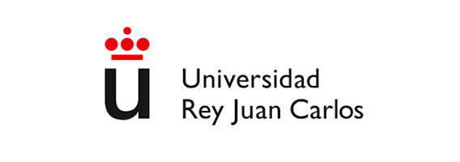

# Ejercicio 5 (encabezado)
## Ejercicio 5 (encabezado  de nivel 2)
### Ejercicio 5 (encabezado  de nivel 3)
#### Ejercicio 5 (encabezado  de nivel 4)
##### Ejercicio 5 (encabezado  de nivel 5)
###### Ejercicio 5 (encabezado  de nivel 6)

# Prueba de texto

Este texto está en la MISMA LÍNEA
pq no hay saltos de línea pero 
editor se escribe en líneas separadas.

Cuando se ponen DOS SALTOS DE LÍNEA seguidos comienza un párrafo nuevo. 

Si en cada línea que escribamos  
hay DOS ESPACIOS y un SALTO DE LÍNEA  
estas líneas estarán SEPARADAS!!!

# Listas no ordenadas

*Viajes por hacer:*
* Praga
* París
* La Habana
* México D.F
* Berlín
* Petra

# Listas ordenadas

*Que meter en la maleta:*
1. Camisetas
2. Pantalones
3. Bolsa de aseo
4. Zapatos
5. Pasaporte

# Resaltado de texto

*Quiero viajar en cursiva*  
**Quiero viajar en negrita**

```
# -- Ejemplo de código en python
a = 2
print("Programa en python")
print(f"La variable a vale {a}")
```

```python
# -- Ejemplo de código en python
a = 4
print("Programa en python")
print(f"La variable a vale {a}")
```

En python la expresión `print(f" a + b = {4 + 1} ")` produce como resultado `a + b = 5` 

# Enlaces 

## Enlaces externos

En este link encontramos información sobre que sitios visitar en Praga [Link](https://www.viajeroscallejeros.com/lugares-que-visitar-praga/)

En este link encontramos información sobre que sitios visitar en México DF [Link](https://www.viajeroscallejeros.com/lugares-que-ver-ciudad-de-mexico/)

## Enlaces internos

La información sobre los sitios que visitar en Praga y méxico está puesta en [los enlaces](#Enlaces) en markdwon.
Hay más información sobre Praga , México DF y Alemania en [las tablas](#Tablas).

# Imágenes

## Imagen en fichero local




## Imagen en URL


# Citas

Un par de citas:

> Cada día sabemos más y entendemos menos (Albert Einstein)

> Si es bueno vivir, todavía es mejor soñar, y lo mejor de todo, despertar (Antonio Machado)


# TABLAS

**EJEMPLOS DE TABLAS**  

**TABLA DE INTERÉS**

|           |  Visitas  |  Platos típicos   |   Dinero  | 
|-----------|-----------|-------------------|-----------|
|  Praga    |  Torre de la Pólvora    |     Kulajda    |  Corona checa    |  
| México DF |  Palacio de Bellas Artes y Alameda Central    |     Gorditas    |     Peso mexicano    |  
|   Berlín  |  Puerta de Brandeburgo     |     Bretzels     |     Euro    |  

**TABLA CON LINKS INCLUIDOS**

|          |  Praga  | México DF | Berlín | 
|----------|-----------|--------|-------|
| Idioma oficial |   Checo   | Espñol  | Alemán  | 
| Palabras más usadas     | [link](https://freetourpraga.com/vocabulario-checo-basico/) | [link](https://psicologiaymente.com/reflexiones/palabras-expresiones-mexicanas)  | [Link](https://www.ef.com.es/blog/language/10-expresiones-alemanas-todos-deberian-saber/) | 
| 